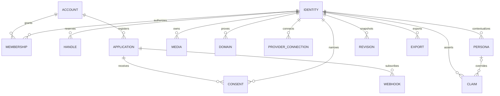
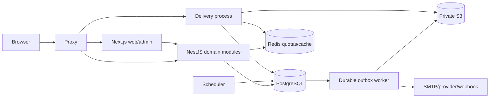

# Domain model and consistency

An Account authenticates and can have multiple Identity memberships. An Identity has an immutable opaque ID, a type and reserved handle history. A Membership grants an action set; it is not an ownership claim about a real person. Personas override selected base claims by registered key and locale.

A Claim is a typed value plus provenance, proof/freshness and disclosure policy. Manual authority and provider/issuer authority are separate records. One selected active authority exists per identity/key/persona/locale. SQL constraints prevent a persona or activated avatar from belonging to another identity.

Membership checks inside mutations lock current identity/member authority. Claim/settings changes snapshot the prior revision, apply their mutation, and persist audit/outbox records transactionally. Database uniqueness preserves handles and selected claim authority under concurrency.

A Consent narrows a specific identity/persona, scopes, fields and expiry; field policy remains an independent gate. A native application credential is distinct from account authentication and from its consent access token.

The delivery process can expose only currently approved public media. Workers validate uploads and persist private variants. A job lease is renewable and reclaimable after worker loss; processing is at-least-once, so side effects and receivers require idempotency.

Deletion immediately hides the identity, revokes disclosure and queues object cleanup. Media/export processing rechecks final state before publishing its result, preventing concurrent deletion from recreating authorized data. Account password/email/locale/deletion, proved account/identity merge, issuer assertions, private credentials/DID, signed federation/migration and gated legacy aggregates have separate current-authority invariants.

Health/metrics are operational projections. They contain bounded status/latency dimensions rather than claim values, application secrets or individual visitor tracking. Opt-in analytics contains daily aggregates. Federation/credentials retain separate public status and private holder contents. Private Prometheus metrics and six alert rules cover process, queue, latency and pool pressure.
